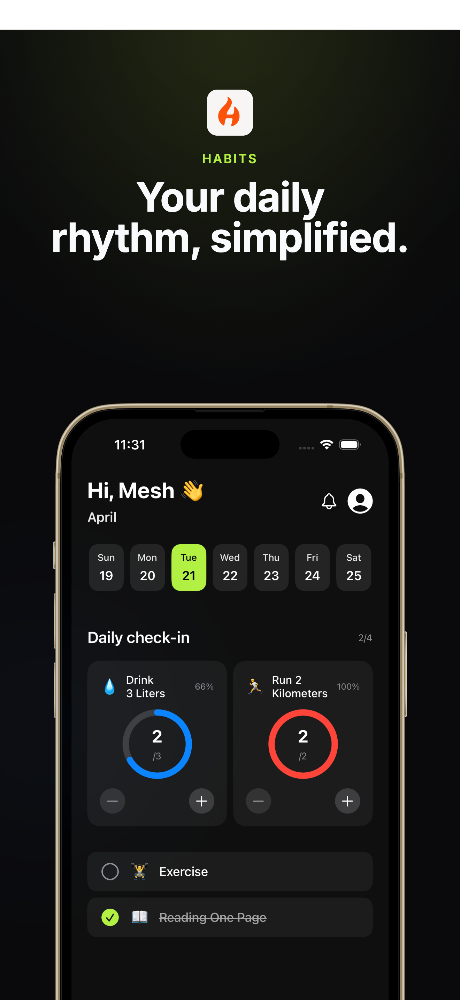
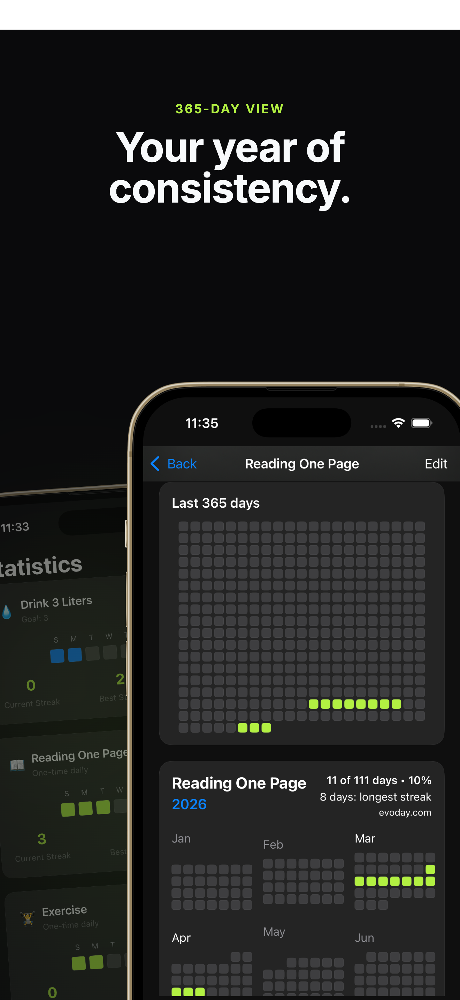
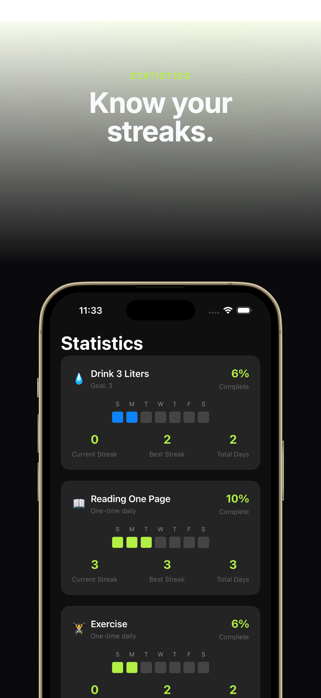
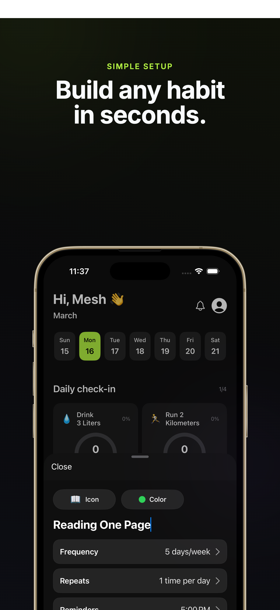

# Habits 📈

A minimalist, high-performance habit tracking application built with **SwiftUI**. Habits is designed to help users build consistency through visual feedback and data-driven insights, all while keeping your personal data private on your own device.

## ✨ Key Features

* **Visual Consistency (Heatmaps):** graphs that visualize your habit streaks over the last 365 days.
* **Smart Daily Check-ins:** Interactive progress rings and trackers for quantifiable goals (e.g., "Drink 3 Liters") and simple binary habits.
* **Granular Statistics:** Detailed breakdown of current streaks, best streaks, and total completion percentages for every habit.
* **Flexible Scheduling:** Customize habits based on weekly frequency and set specific reminders to stay on track.
* **Privacy Focused:** No cloud sync, no tracking. Your habits and personal data are stored 100% locally on your iPhone.
* **Customization:** Organize your priority habits with an intuitive reordering system and custom icons.

## 📸 App Preview

| Daily Dashboard | Habit Heatmaps | Deep Statistics | Habit Customization |
| :---: | :---: | :---: | :---: |
|  |  |  |  |

## 🛠 Technical Highlights
* **SwiftUI:** Utilizing modern declarative UI for smooth animations and a responsive dark-mode interface.
* **Local Persistence:** Engineered for speed and privacy using local data storage.
* **Custom Graphics:** Custom-built progress rings and heatmaps using SwiftUI Shapes and Grids.

---

> [!NOTE]  
> **Portfolio Showcase:** The source code for Evoday is hosted in a private repository. This public mirror serves to demonstrate the app's architectural design and UI/UX implementation.
